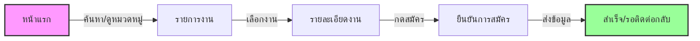

# PreJob - การออกแบบกระบวนการใช้งาน (User Process Design)

เอกสารนี้แสดงเส้นทางของผู้ใช้งาน (User Journey) หลักสำหรับแพลตฟอร์ม PreJob เพื่อแสดงให้เห็นถึงความลื่นไหลในการใช้งานทั้งฝั่งคนหางานและนายจ้าง

## 🎯 คอนเซปต์หลัก
**"หางานไว ได้คนคุณภาพ ทันใจ"**
PreJob เชื่อมต่อคนหางานพาร์ทไทม์กับนายจ้างผ่านระบบที่ออกแบบมาเพื่อมือถือโดยเฉพาะ (Mobile-First)

---

## 🗺️ 1. เส้นทางคนหางาน (Job Seeker Journey)
**เป้าหมาย:** หางานพาร์ทไทม์ที่ใช่ และสมัครได้ภายในไม่กี่นาที

### แผนภาพการทำงาน (Workflow Diagram)

### ขั้นตอนสำคัญ
1.  **การค้นพบ (Discovery):**
    *   ผู้ใช้เข้ามาที่หน้าแรก (Home Page)
    *   ใช้ "Smart Search" หรือเลือกดู "งานยอดนิยม"
    *   *จุดเด่น:* ป้าย "Right Now" แสดงงานที่ต้องการคนด่วน

2.  **การเลือก (Selection):**
    *   ดูรายการงานใน `Job Listings` พร้อมตัวกรอง (สถานที่, ค่าจ้าง, ประเภทงาน)
    *   กดดูรายละเอียดที่ `Job Details`
    *   *จุดเด่น:* แสดงค่าจ้างและสถานที่ชัดเจน (Map Integration)

3.  **การลงมือทำ (Action):**
    *   อ่านรายละเอียดและกดปุ่ม "Apply Now" (สมัครทันที)
    *   ระบบยืนยันการสมัครเรียนร้อย (Mockup)

---

## 🏢 2. เส้นทางนายจ้าง (Employer Journey)
**เป้าหมาย:** ลงประกาศงานและจัดการผู้สมัครได้อย่างมีประสิทธิภาพ

### แผนภาพการทำงาน (Workflow Diagram)

### ขั้นตอนสำคัญ
1.  **การเริ่มต้น (Onboarding):**
    *   เข้าสู่ระบบผ่าน Email/Username หรือ Social (Google/Facebook)
    *   *จุดเด่น:* รองรับการล็อกอินได้หลากหลายเพื่อความสะดวก

2.  **การจัดการ (Management):**
    *   เข้ามาที่ `Dashboard`
    *   ดูสถิติ "งานที่เปิดรับ" (Active Jobs) และ "ผู้สมัครล่าสุด"
    *   *จุดเด่น:* หน้าจอสะอาดตา (Clean UI) ดูง่าย

3.  **การรับสมัคร (Recruitment):**
    *   กดปุ่ม "Post a Job" (ลงประกาศงาน)
    *   กรอกรายละเอียด (ชื่องาน, ค่าจ้าง, สถานที่, หมวดหมู่)
    *   ประกาศขึ้นระบบทันที

4.  **การคัดเลือก (Selection):**
    *   ดูการ์ดผู้สมัครใน Dashboard
    *   เช็ค "คะแนนรีวิว" และ "ป้ายกำกับ" (เช่น ตรงต่อเวลา)
    *   กดปุ่ม "นัดหมาย" เพื่อติดต่อผู้สมัคร

---

## 🔄 3. ระบบรีวิวและสร้างความเชื่อมั่น (Review & Feedback Loop)
**เป้าหมาย:** สร้างสังคมการทำงานที่น่าเชื่อถือ

### ขั้นตอน
1.  **จบงาน:** หลังจากทำงานเสร็จสิ้น
2.  **ให้คะแนน:** นายจ้าง/ลูกจ้าง ให้ดาว (1-5 ดาว)
3.  **ความคิดเห็น:** ติดป้ายกำกับจุดเด่น (เช่น "เรียนรู้ไว", "จ่ายเงินตรง")
4.  **อัปเดตโปรไฟล์:** คะแนนจะถูกนำไปแสดงในโปรไฟล์เพื่อใช้ประกอบการพิจารณาในอนาคต

---

## 📱 จุดเด่นบนมือถือ (Mobile Experience)
*   **Touch-Optimized:** ปุ่มขนาดใหญ่ กดง่าย ฟอร์มกรอกสะดวก
*   **Responsive:** การแสดงผลปรับเปลี่ยนตามหน้าจออัตโนมัติ
*   **Native Feel:** เมนูแบบ Bottom Sheet และ Animation ที่ลื่นไหล
